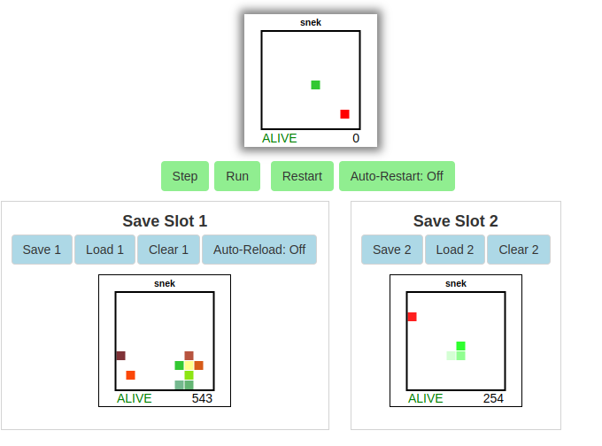

Hack-A-Day is a project I'm doing in November, where I try to make 30 new projects, in 30 days.

# Day 26: Hack-An-Minigame

Day 26 is a minigame. Your only controls are "save" and "restore". This is in preparation for another hack tomorrow.

Demo available [here](https://tilde.za3k.com/hackaday/mini).

Source available on [github](https://github.com/za3k/day26_mini).
